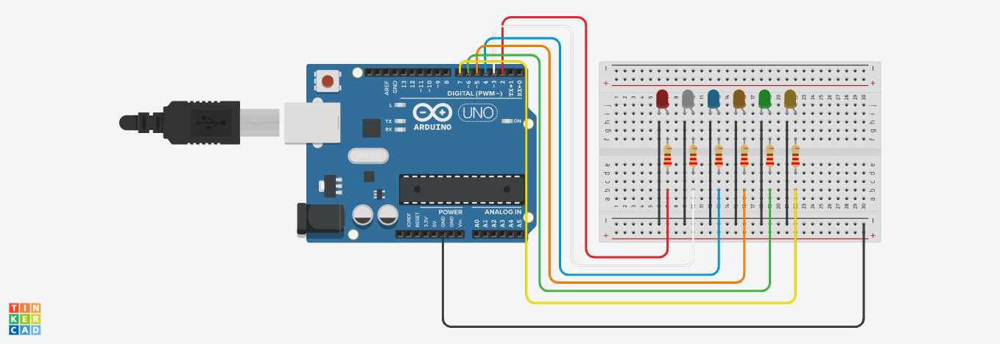

# An Animation Project Arduino 
It is an arduino code that allows you to make animations with LEDs.

## 🎓 Goal achieved
    - [x] Understand of Arduino work inside
    - [x] Get it touch with arduino programming
    - [x] Work in team to accelerate the programming process

Main Contributor:
    [Rochdy](https://github.com/Rochdy-max)

You can get all the TinkerCard board [here](assets/Shiny_Luulia-Albar.brd)
PS: About the TinkerCard board, you can download and load it in the online [TinkerCard platform](https://www.tinkercad.com/)